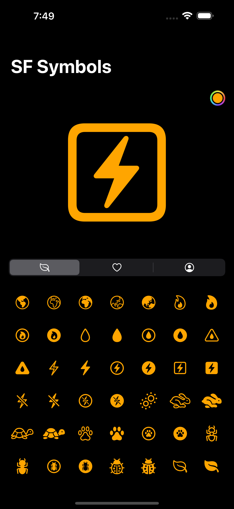
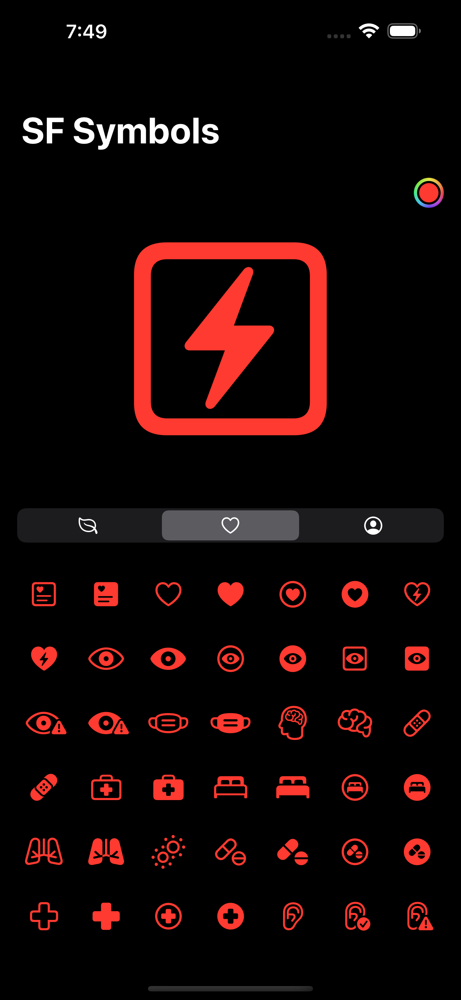

# SFSymbolsPicker

A list of SFSymbols 3 grouped by category.

## Categories

- [x] Communication
- [x] Weather
- [x] Objects & Tools
- [x] Devices
- [x] Gaming
- [x] Connectivity
- [x] Transport
- [x] Human
- [x] Nature
- [x] Editing
- [x] Text Formatting
- [x] Media
- [x] Keyboard
- [x] Commerce
- [x] Time
- [x] Health
- [x] Shapes
- [x] Arrows
- [x] Indices
- [x] Maths

## Installation

### Swift Package Manager

```swift
dependencies: [
    .package(url: "https://github.com/cavalcantedosanjos/SFSymbolsPicker.git")
]
``` 

### Manually

Fell free to copy/paste anything you need.

## How to use

```swift
    @State var symbol = "leaf"
    @State var color = Color.accentColor
    
    SFSymbolsView(symbol: $symbol, color: $color,symbols: [.nature, .human, .health])

``` 



